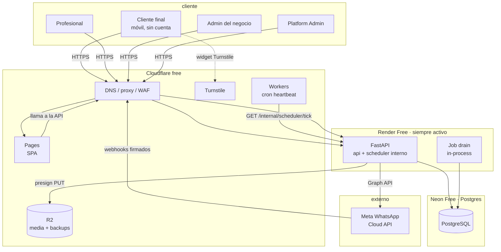

# Arquitectura — Tempus

> Estado: **fase de arquitectura aprobada. Sin código de producción.**
> Este documento es la fuente de verdad del diseño. Las decisiones con alternativas
> descartadas están en [`docs/adr/`](docs/adr/README.md).

## Mapa de los entregables de la §51

| §51 | Tema | Sección |
|-----|------|---------|
| 1 | Nombre técnico | [2. Nombre y convenciones](#2-nombre-y-convenciones) |
| 2 | Arquitectura general | [3. Arquitectura general](#3-arquitectura-general) |
| 3 | Diagrama de componentes | [4. Diagrama de componentes](#4-diagrama-de-componentes) |
| 4 | Modelo de datos | [5. Modelo de datos](#5-modelo-de-datos) |
| 5 | Relaciones entre entidades | [6. Relaciones entre entidades](#6-relaciones-entre-entidades) |
| 6 | Estrategia multi-tenant | [7. Estrategia multi-tenant](#7-estrategia-multi-tenant) |
| 7 | Estrategia de disponibilidad | [8. Motor de disponibilidad](#8-motor-de-disponibilidad) |
| 8 | Anti-double-booking | [9. Estrategia anti-doble-reserva](#9-estrategia-anti-doble-reserva) |
| 9 | Autenticación | [10. Autenticación y autorización](#10-autenticación-y-autorización) |
| 10 | Secure tokens | [11. Secure tokens](#11-secure-tokens) |
| 11 | WhatsApp | [12. Arquitectura de WhatsApp](#12-arquitectura-de-whatsapp) |
| 12 | Background jobs | [13. Arquitectura de background jobs](#13-arquitectura-de-background-jobs) |
| 13 | Estructura del proyecto | [14. Estructura del proyecto](#14-estructura-del-proyecto) |
| 14 | Diseño de API | [15. Diseño de API](#15-diseño-de-api) |
| 15 | Testing | [16. Estrategia de testing](#16-estrategia-de-testing) |
| 16 | Seguridad | [17. Estrategia de seguridad](#17-estrategia-de-seguridad) |
| 17 | Despliegue | [18. Estrategia de despliegue](#18-estrategia-de-despliegue) |
| 18 | Roadmap | [19. Roadmap por fases](#19-roadmap-por-fases) |
| 19 | Riesgos | [20. Riesgos técnicos](#20-riesgos-técnicos) |
| 20 | Decisiones | [21. Decisiones arquitectónicas](#21-decisiones-arquitectónicas) |

---

## 1. Alcance y principios

El sistema es una plataforma SaaS multi-tenant de gestión y reservas de turnos para
negocios con profesionales y servicios. El vocabulario del dominio es genérico
(`Business`, `Professional`, `Service`, `Customer`, `Booking`); **ninguna decisión de
diseño puede asumir una profesión concreta**.

Tres principios gobiernan el diseño y prevalecen sobre la comodidad:

1. **La base de datos es la autoridad.** Ninguna garantía de integridad se
   implementa solo en Python o en el navegador. El frontend no es un guardián.
2. **Una sola fuente de verdad por regla.** La disponibilidad se calcula en un único
   módulo del backend. No hay una segunda implementación parcial en el cliente.
3. **El aislamiento entre tenants se defiende en tres capas** (FK compuestas, RLS y
   capa de aplicación). Un forgetting en una capa no abre una fuga.

Lo que **no** es objetivo del MVP: pagos, marketplace, dominios personalizados, mapas,
email al cliente y estadísticas avanzadas. Cada uno está registrado como decisión
aplazada en la [sección 22](#22-decisiones-aplazadas) con su motivo.

## 2. Nombre y convenciones

- **Nombre técnico:** `tempus`.
- Paquete Python: `app`. Artefacto Docker: `tempus-api`.
- Scope de npm: ninguno (proyecto privado, sin publicación).

**Pendiente antes de la Fase 0:** verificar disponibilidad de dominio y de marca en
la jurisdicción objetivo. El nombre es una decisión reversible y barata de cambiar
antes de tener datos, e irreversible y cara después. No se da por hecho.

Convenciones transversales:

- **Timezone:** todo instante se persiste en UTC (`timestamptz`). Toda fecha "de
  negocio" (un día de agenda) se persiste además como `date` local del negocio.
- **Dinero:** `numeric(12,2)` + ISO 4217. Prohibido `float`.
- **IDs:** `UUIDv7` como clave primaria en toda tabla.
- **Booleanos de estado:** prefijos explícitos (`is_active`, `has_...`). Se evita
  confiar en el valor por defecto de un `bool` nullable.
- **Timestamps:** `created_at` / `updated_at` en toda tabla, `NOT NULL`,
  `server_default = now()`.

## 3. Arquitectura general

**Monolito modular** (ADR-0001). Un solo proceso de despliegue, un solo esquema de
base de datos, un solo repositorio. Los límites entre dominios se imponen por
convención de imports, no por red.

Módulos del dominio:

```
auth · businesses · professionals · services · schedules
availability · bookings · customers · notifications · reports
```

Cada módulo es autonomous en cuanto a persistencia: **ningún módulo importa
directamente los repositorios de otro**. Las dependencias apuntan hacia adentro:

```
api/routers  →  services  →  repositories  →  db
                     ↓
               core (config, security, errors, logging)
```

La dependencia crítica es `availability` → `bookings`: el motor de disponibilidad
necesita **leer** reservas, pero `bookings` no debe contener lógica de
disponibilidad. Por eso las reservas bloqueantes viven en su propia tabla y el motor
las recibe como datos, no como llamadas a un repositorio de reservas.

Rutas del frontend (SPA única con routing por pathname):

| Ruta | Destino |
|---|---|
| `/` | Home de la plataforma (opcional, marketplace futuro) |
| `/{slug}` | Página pública del negocio (reserva sin cuenta) |
| `/{slug}/reservado` | Confirmación tras reservar |
| `/r/{token}` | Gestión de reserva por secure token: ver, cancelar, reprogramar |
| `/panel/*` | Panel del profesional |
| `/admin/*` | Panel del administrador del negocio |

La página pública vive en la raíz del dominio y resuelve por slug, como exige la §5.
Los slugs reservados (`api`, `admin`, `panel`, `r`, `assets`, `static`, `login`,
`www`, `app`, `api`, `docs`, `_`) se rechazan en el alta y se guardan en la tabla
`slug_reservations` para que no puedan reclamarse después.

## 4. Diagrama de componentes



`PA` (platform admin) comparte frontend con `A` pero usa un guard y rutas separadas
(`/api/v1/platform/*`); nunca comparte la tabla de usuarios.

**Nota sobre `CFW`:** el Cloudflare Worker con cron trigger no es un adorno. En el
plan de despliegue gratuito es lo que garantiza que el backend no se duerma y que
los recordatorios se disparen. Está descrito en detalle en la
[sección 18](#18-estrategia-de-despliegue).

## 5. Modelo de datos

27 tablas. Son 20 con RLS y 7 sin ella; la razon de cada ausencia esta en §5.8.

De las 27, cuatro no son "de tenant" en el sentido estricto de §5.1:
- `rate_limit_buckets` (§5.7) se mide por IP y por email, y por eso es anterior al
  tenant.
- `businesses`, `platform_users` y `slug_reservations` son globales: definen o
  reservan la identidad global y no cuelgan de un negocio.

El resto lleva `business_id NOT NULL` y FK a `businesses(id)`, **con una excepcion
deliberada**: `jobs.business_id` es nullable, porque los jobs de plataforma no
pertenecen a un negocio. `jobs` no lleva RLS (§5.8).

### 5.1 Identidad y tenancy

**`businesses`**
| columna | tipo | notas |
|---|---|---|
| `id` | `uuid` PK | UUIDv7 |
| `slug` | `citext` UNIQUE | Identidad pública. **No es clave foránea en ningún lado** |
| `name` | `text` | |
| `description` | `text` | |
| `timezone` | `text` | IANA, p. ej. `America/Argentina/Buenos_Aires` |
| `locale` | `text` | BCP 47, p. ej. `es-AR` |
| `currency` | `char(3)` | ISO 4217 |
| `slot_interval_minutes` | `smallint` | Grilla de slots. Default 15 |
| `min_lead_minutes` | `smallint` | Antelación mínima. Default 60 |
| `max_advance_days` | `smallint` | Default 60 |
| `cancellation_window_minutes` | `smallint` | Default 120 |
| `status` | `enum` | `active`, `suspended`, `trial` |
| `phone_e164` | `text` | WhatsApp del negocio |
| `address_text` | `text` | Sin geocodificación en el MVP (§34) |
| `brand_color` | `text` | Hex |
| `logo_media_id` | `uuid` | FK a `media` |
| `cover_media_id` | `uuid` | FK a `media` |

**`business_users`** — identidad de autenticación de una persona en un negocio.
| columna | tipo | notas |
|---|---|---|
| `id` | `uuid` PK | |
| `business_id` | `uuid` FK | |
| `email` | `citext` | `UNIQUE (business_id, email)` |
| `password_hash` | `text` | Argon2id |
| `full_name` | `text` | |
| `role` | `enum` | `admin`, `staff` |
| `status` | `enum` | `active`, `invited`, `disabled` |
| `last_login_at` | `timestamptz` | |

**`platform_users`** — personal de la plataforma. **Tabla separada y sin
`business_id`**, por diseño: un platform admin nunca debe poder convertirse en
usuario de un tenant por un cambio de datos mal hecho.

**`professionals`** — el profesional es un concepto de negocio, no una cuenta.
| columna | tipo | notas |
|---|---|---|
| `id` | `uuid` PK | |
| `business_id` | `uuid` FK | |
| `user_id` | `uuid` FK NULL | A `business_users`. NULL = existe en la agenda pero no tiene login |
| `display_name` | `text` | Lo que ve el cliente |
| `bio` | `text` | |
| `color` | `text` | Para diferenciar en la agenda |
| `is_active` | `bool` | `false` = no reservable |
| `sort_order` | `int` | |
| `archived_at` | `timestamptz` NULL | Soft delete |

`user_id` nullable es deliberado: un negocio puede tener 8 profesionales y solo 3
con acceso al panel. Es el caso normal, no una excepción.

### 5.2 Catálogo

**`services`** ... (contenido omitido por brevedad, estructura igual que original)

### 5.3 Clientes

**`customers`** ... (contenido omitido por brevedad)

### 5.4 Horarios

**`business_hours`**, **`business_exceptions`**, **`business_exception_windows`**,
**`holidays`**, **`professional_schedules`**, **`time_off`**, **`blocks`** ... (omitidos)

### 5.5 Reservas

**`bookings`**, **`booking_events`**, **`idempotency_keys`** ... (omitidos)

### 5.6 WhatsApp y notificaciones

**`whatsapp_connections`**, **`whatsapp_templates`**, **`notification_requests`**,
**`webhook_events`** ... (omitidos)

### 5.7 Infraestructura

**`jobs`**, **`refresh_tokens`**, **`audit_log`**, **`media`**,
**`slug_reservations`**, **`rate_limit_buckets`** ... (omitidos)

### 5.8 Qué tablas llevan RLS y cuáles no

De las 27 tablas, **20 llevan `ROW LEVEL SECURITY` y `FORCE ROW LEVEL SECURITY`**, y
7 no llevan ninguna de las dos. La lista no es una convención: está escrita en
`app/models/__init__.py` como `GLOBAL_TABLES`, la aplica la migración `0002`, y
`tests/unit/test_orm_metadata.py` falla si el modelo y la base se separan.

**Las 20 con RLS**, todas de tenant:
`audit_log`, `blocks`, `booking_events`, `bookings`, `business_exception_windows`,
`business_exceptions`, `business_hours`, `business_users`, `customers`, `holidays`,
`idempotency_keys`, `media`, `notification_requests`, `professional_schedules`,
`professional_services`, `professionals`, `services`, `time_off`,
`whatsapp_connections`, `whatsapp_templates`.

**Las 7 sin RLS**, y por qué:

| tabla | razón |
|---|---|
| `businesses` | Es la fila de la que cuelga el resto. Una política que comparara `business_id` contra sí misma no filtraría nada. Se aísla con permisos: el rol de la app no tiene INSERT/UPDATE/DELETE, solo SELECT. |
| `platform_users` | Personal de la plataforma, que por definición no pertenece a un negocio (§5.1). Sin permiso de escritura para el rol de la app. |
| `slug_reservations` | Reserva global de un slug. Se escribe desde la consola de la plataforma, no desde una request de tenant. |
| `rate_limit_buckets` | Anterior al tenant: se mide por IP y por email (§5.7). |
| `webhook_events` | Bandeja de entrada de Meta. Es de la plataforma, no de un negocio. |
| `refresh_tokens` | No tiene `business_id`: cuelga de `user_id` o `platform_user_id`. Ver la nota de abajo. |
| `jobs` | La cola es del sistema. El dispatcher saca trabajos de varias cuentas a la vez a propósito; filtrarla por tenant rompería el drenado. `business_id` sigue nullable y presente en la fila para poder depurar y para que un handler de negocio verifique que no le llego algo global. |

**La nota sobre `refresh_tokens`.** Es la única de las siete cuyo aislamiento no
depende de una decisión de permisos sino de que la aplicación filtre bien. No hay
`business_id` porque el token pertenece a una *persona*, que puede ser de un negocio
o de la plataforma, y la tabla tiene un CHECK que exige exactamente uno de los dos
(`ck_refresh_tokens_exactly_one_principal`). El aislamiento real es: solo se
consultan tokens del principal autenticado.

Es una dependencia del código, no de la base, y conviene decirlo explícito en vez de
dejarlo implícito:

- Una consulta a `refresh_tokens` sin filtro de `user_id` devuelve metadatos de otros
  tenants (`user_agent`, `ip_address`, fechas).
- El impacto está acotado por diseño: se guarda `token_hash` (SHA-256), nunca el
  token. Robar una fila no permite autenticarse, porque el hash no es el secreto
  que se presenta.
- Si alguna vez esto deja de ser aceptable, el camino es agregar `business_id` a la
  tabla y ponerla en RLS. No lo tiene ahora porque exigiría una migración de datos
  para proteger metadatos, y el costo no está justificado mientras el hash impida
  el uso del token. **Es una decisión, no un olvido**, y por eso está escrita acá.

**Total: de las 27 tablas, 20 con RLS y 7 sin ella.**

## 6. Relaciones entre entidades

... (omitido por brevedad)

## 7. Estrategia multi-tenant

**Esquema compartido con `business_id` + RLS** (ADR-0002). Tres capas, de la más
fuerte a la más débil:

### Capa 1 — La base de datos lo impide

FK compuestas. Cada tabla padre que se referencia desde una tabla hija declara
unicidad del par:

```sql
ALTER TABLE professionals
  ADD CONSTRAINT professionals_id_business_key UNIQUE (id, business_id);
```

Y la hija referencia el par, con `business_id` desnormalizado:

```sql
ALTER TABLE professional_services
  ADD CONSTRAINT ps_tenant_fk_professional
  FOREIGN KEY (professional_id, business_id)
  REFERENCES professionals (id, business_id) ON DELETE CASCADE;
```

Consecuencia: es **físicamente imposible** que exista
`professional_id = P` (del tenant A) junto a `business_id = B` (del tenant B). No es una
convención que se pueda violar por descuido: es una restricción que rechaza la fila.

El precio es desnormalizar `business_id` en las tablas de unión. Es un costo de
espacio insignificante a cambio de mover un invariante de "confiar en el código" a
"garantizado por el motor de almacenamiento".

### Capa 2 — Row Level Security

```sql
ALTER TABLE bookings ENABLE ROW LEVEL SECURITY;
ALTER TABLE bookings FORCE ROW LEVEL SECURITY;

CREATE POLICY bookings_tenant_isolation ON bookings
  USING      (business_id = current_setting('app.current_business_id', true)::uuid)
  WITH CHECK (business_id = current_setting('app.current_business_id', true)::uuid);
```

`FORCE` es necesario: sin él, el dueño de la tabla la bypasea. Con `FORCE`, también
el rol de la aplicación queda sujeto.

El contexto se inyecta al inicio de **cada transacción**, nunca a nivel de sesión:

```sql
SET LOCAL app.current_business_id = '...';
```

`SET LOCAL` es lo correcto y no es negociable. El motivo es concreto: si se usara
`SET` a nivel de sesión, al conectar por un pooler en modo transacción (PgBouncer,
que es lo que se usa por defecto en plataformas gestionadas) la siguiente transacción
puede recibir una conexión que ya traía el valor de **otro tenant**. El síntoma sería
una fuga de datos entre negocios en producción y ningún error en los tests, porque en
tests cada conexión es nueva. `SET LOCAL` ata el valor a la transacción y se descarta
en el commit.

**Rol de aplicación sin privilegios de bypass.** El backend conecta con un rol que
no es el dueño de las tablas y por tanto está sujeto a la RLS.

**Worker y tareas programadas** también deben inyectar el contexto. En la cola, cada
job lleva `business_id` y el handler abre su propia transacción con el `SET LOCAL`
correspondiente. Un job sin `business_id` es un bug y falla ruidosamente.

### Capa 3 — Aplicación

- Todo acceso a datos pasa por un repositorio que **exige** un `TenantContext`. No
  hay `session.query(Booking)` a secas en ninguna parte del código.
- El `business_id` sale del **JWT** (`tid`), nunca de un parámetro del cliente
  (ADR-0010).
- `TenantContext` se inyecta como dependencia de FastAPI y vive en un contexto por
  request.
- Test parametrizado que recorre **todas** las tablas de tenant y verifica que un
  usuario del tenant A no lee ni escribe nada del tenant B, en cada endpoint. Un solo
  endpoint sin cubrir es una fuga; el test lo vuelve imposible de olvidar.

## 8. Motor de disponibilidad

... (omitido por brevedad)

## 9. Estrategia anti-doble-reserva

... (omitido por brevedad)

## 10. Autenticación y autorización

Solo hay autenticación para usuarios internos (§27). El cliente público no tiene
cuenta, no tiene login y no se le pide contraseña jamás.

### 10.1 Passwords

Argon2id vía `pwdlib` con `PasswordHash.recommended()`, que es lo que recomienda la
documentación actual de FastAPI. Parámetros por defecto de la librería. Nunca se
comparan ni almacenan en texto plano. El hash nunca sale de la base de datos por la
API ni por un log.

### 10.2 Access token

JWT HS256, 15 minutos. Claims:

```json
{
  "sub": "<business_user_id>",
  "tid": "<business_id>",
  "role": "admin",
  "scopes": ["bookings:write"],
  "jti": "<uuid>",
  "iat": 1700000000,
  "exp": 1700000900,
  "typ": "access"
}
```

`tid` es el tenant. Es la **única** fuente de `business_id` en la API interna
(ADR-0010). Vive solo en memoria en el frontend: nunca en `localStorage`, donde un
XSS lo exfiltraría con facilidad.

### 10.3 Refresh token con rotation y detección de reuse

Opaque, 256 bits de `secrets.token_urlsafe`, no JWT. En la base solo su SHA-256.

Flujo: el access expira → el cliente llama a `/auth/refresh` con la cookie
`HttpOnly; Secure; SameSite=Strict` → se emite un refresh nuevo y **el anterior se
revoca**, keduanya dentro de la misma `family_id`.

Si llega un refresh **ya revocado**, eso solo puede significar que un token fue
robado y reutilizado. Acción inmediata: revocar la **familia completa**, invalidar
todos los access tokens derivados forzando `status = 'locked'` en el usuario, y
escribir un `audit_log` de seguridad. Es el comportamiento estándar y es la razón de
guardar el árbol de familias.

La cookie se limita por `path` a `/api/v1/auth` para reducir la superficie en caso
de XSS.

### 10.4 RBAC

| Capacidad | admin | staff | professional | platform_admin |
|---|---|---|---|---|
| Configurar negocio, horarios, feriados | sí | no | no | sí |
| Gestionar profesionales, servicios | sí | sí | no | sí |
| Ver agenda completa del negocio | sí | sí | **solo su propia** | sí |
| Crear/cancelar cualquier reserva | sí | sí | **solo la propia** | sí |
| Registrar walk-in | sí | sí | sí | sí |
| Ver datos de otros tenants | no | no | no | sí |
| Gestión de tenants | no | no | no | sí |

`platform_admin` es un rol de `platform_users`, con su propio guard y sus propias
rutas. **Nunca se modela como un `business_users` con `role = 'platform_admin'`**:
mezclar ambos garantiza que algún día una asignación de rol conceda acceso cruzado.

`staff` existe para que el dueño pueda delegar sin dar el control de la
configuración. Un negocio de 6 personas rara vez tiene un solo administrador real.

### 10.5 Rate limiting

Implementado sobre Postgres (ADR-0014, decisión de costo): tabla `rate_limit_buckets`
con ventana deslizante y un `INSERT ... ON CONFLICT DO UPDATE` atómico. Sin servicio
adicional. Es suficiente a la escala de este producto.

Límites distintos por clase de endpoint:

| Endpoint | Límite | Razón |
|---|---|---|
| `/auth/login` | 5/min por IP, 10/min por email | Fuerza bruta |
| `POST /public/bookings` | 10/min por IP, 5/hora por teléfono | Costo de Meta + abuso |
| `/internal/scheduler/tick` | 2/min por IP + bearer token | Superficie interna |
| Resto público | 120/min por IP | |
| Panel (autenticado) | 600/min por usuario | |

### 10.6 Login pre-tenant y rol dedicado con BYPASSRLS

El login de negocio (`/auth/login`) es una operación **pre-tenant**: el cliente envía
email y password, pero el servicio **aún no sabe** de qué `business_id` viene el usuario.
La RLS con `FORCE ROW LEVEL SECURITY` en `business_users` (ADR-0002) bloquea cualquier
`SELECT` sin `app.current_business_id`, incluyendo al owner de la tabla.

La premisa original de la migración `0004_login_functions` —"una función `SECURITY DEFINER`
corre como owner y saltea la RLS de esa tabla"— **es falsa** cuando la tabla tiene
`FORCE ROW LEVEL SECURITY`, porque el owner también está sujeto a la política.

La solución implementada (migración `0005_login_definer_role`):

1. **Rol dedicado `tempus_login_definer`** con `BYPASSRLS`, `NOLOGIN`, `NOINHERIT`.
   Solo existe para ejecutar las funciones de lookup pre-tenant.
2. **Ownership de `auth_business_user_for_login`** transferido a este rol.
   La función es `SECURITY DEFINER` y corre como `tempus_login_definer`, que tiene
   `BYPASSRLS` y por tanto saltea la RLS de `business_users`.
3. **Privilegios mínimos**: `SELECT` solo en las 6 columnas que la función lee
   (`id, business_id, password_hash, role, status, full_name`). Nada de escritura.
4. `tempus_owner` es miembro del rol **CON ADMIN OPTION** para permitir el downgrade
   de la migración (cambio de ownership de vuelta a `tempus_owner`).
5. `tempus_app` solo tiene `EXECUTE` sobre la función. `PUBLIC` no tiene nada.

`auth_platform_user_for_login` **no cambia**: `platform_users` no tiene RLS, así que
su función sigue siendo owner `tempus_owner` y no necesita bypass.

**Corrección a la premisa de 0004**: la documentación de esa migración afirmaba que
`SECURITY DEFINER` saltea la RLS. Eso es cierto solo sin `FORCE ROW LEVEL SECURITY`.
Con `FORCE`, el owner también está sujeto a la política. El ADR-0016 registra esta
corrección y la decisión del rol dedicado.

## 11. Secure tokens

El §7 es específico y lo diseño exactamente como pide.

**Generación:** `secrets.token_urlsafe(32)` → 256 bits de entropía, del CSPRNG del
sistema operativo. No es derivable, no es secuencial, no se construye a partir del
`booking_id`.

**Almacenamiento:** `secure_token_hash = sha256(token)` en `bytea`, con índice
`UNIQUE`. **El token en claro jamás se persiste.** Si alguien extrae la base de
datos, no obtiene nada accionable. La comparación es por el hash (búsqueda exacta
sobre un índice único) y el tiempo de respuesta no filtra información relevante
porque el token tiene 256 bits de entropía: adivinarlo está fuera del alcance.

**Rutas de uso.** El cliente final nunca ve un `booking_id`. La URL de gestión es:

```
https://dominio/r/<token>
```

Los endpoints de gestión resuelven **exclusivamente por token**:

```
GET  /api/v1/public/bookings/{token}
POST /api/v1/public/bookings/{token}/cancel
POST /api/v1/public/bookings/{token}/reschedule
```

No existe ningún endpoint público de gestión que tome un `booking_id`. Esto elimina
el caso 9 del §37 por construcción, no por validación: no hay ruta donde la
manipulación de un id haga algo.

**Qué autoriza y qué no.** El token da acceso a **su propia** reserva y solo a
operaciones de cliente: ver, cancelar, reprogramar. No da acceso a la agenda del
negocio, a datos del cliente, a otros clientes ni a nada del panel. La autorización
se re-deriva del recurso, no del token por sí solo.

**Expiración.** El token no expira. La alternativa (expirar a los 90 días) rompe la
experiencia cuando alguien quiere consultar una cita de hace meses, y no agrega
seguridad real: el token sigue siendo la única credencial y su_entropy ya es alta.
Lo que sí existe es `token_rotated_at` para invalidación manual por parte del
admin, útil ante una queja de privacidad.

**Reglas de cancelación** revalidadas en cada request contra la base: no se puede
cancelar una reserva ya cancelada, completada o con `no_show`, ni una reserva cuya
`cancellation_window_minutes` ya venció, ni una que esté en curso. La validación no
depende de que el endpoint público y el panel apliquen la misma regla: la regla vive
en el servicio de bookings y ambos la llaman.

## 12. Arquitectura de WhatsApp

... (omitido por brevedad)

## 13. Arquitectura de background jobs

... (omitido por brevedad)

## 14. Estructura del proyecto

... (omitido por brevedad)

## 15. Diseño de API

... (omitido por brevedad)

## 16. Estrategia de testing

... (omitido por brevedad)

## 17. Estrategia de seguridad

... (omitido por brevedad)

## 18. Estrategia de despliegue

... (omitido por brevedad)

## 19. Roadmap por fases

... (omitido por brevedad)

## 20. Riesgos técnicos

... (omitido por brevedad)

## 21. Decisiones arquitectónicas

Ver [`docs/adr/`](docs/adr/README.md).

## 22. Decisiones aplazadas

... (omitido por brevedad)